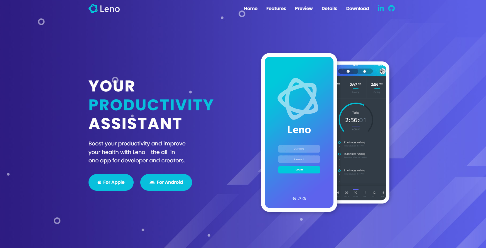

# Leno

> Leno is a modern productivity and health app designed for developers and creators to enhance focus, organization, and well-being. This sleek, responsive website offers a comprehensive overview of Leno's features, including real-time data, a visual editor, calendar integration, and easy reading modes.

## Table of Contents

- [Live Demo](#live-demo)
- [Screen](#screen)
- [Features](#features)
- [Technologies Used](#technologies-used)
- [Getting Started](#getting-started)
- [License](#license)

## Live Demo

- You can access the live demo via [Netlify]().

## Screen

[]()

## Features

- **Responsive Design**: Optimized for all devices and screen sizes, ensuring a seamless user experience on desktops, tablets, and smartphones.
- **Navigation Menu**: Easy-to-use navigation bar with quick access to key sections including Home, Features, Preview, Details, and Download.
- **Interactive Hero Section**: Engaging introduction with clear call-to-action buttons for Apple and Android app downloads.
- **Testimonials Section**: Showcases user reviews and feedback to build credibility and highlight the app’s benefits through real-world experiences.
- **Features Overview**: Detailed description of key features with icons and visual elements to effectively communicate the app’s value.
- **Preview Video**: Embedded video with a play button to provide a visual demonstration of the app’s interface and functionality.
- **Download Options**: Clear download links for both iOS and Android platforms, encouraging users to try the app.
- **Screenshots Gallery**: A visual gallery displaying various screenshots of the app to give users a glimpse of the user interface and features.
- **Detailed Information**: Sections providing in-depth information about the app’s benefits, including integration with calendars and user-friendly design.
- **Social Media Links**: Direct links to social media profiles for easy connection and updates.
- **Footer Information**: Includes company logo, quick links to important sections, and social media icons, along with copyright and credits.

## Technologies Used

- **HTML5**: For structuring the content of the web pages.
- **CSS3**: For styling and layout, ensuring a visually appealing design.
- **JavaScript (ES6)**: For adding interactivity and dynamic content.
- **Font Awesome**: For incorporating a wide range of icons.
- **SVG Graphics**: For high-quality, scalable vector graphics.

## Getting Started

### Prerequisites

To set up and run this project locally, you'll need:

- A modern web browser (Chrome, Firefox, Edge, etc.)
- A text editor (e.g., VSCode, Sublime Text)
- Basic knowledge of HTML, CSS, and JavaScript

### Installation

1. **Clone the repository**:

```bash
git clone https://github.com/akaBaytar/leno-assistant.git
```

2. **Navigate to the project directory**:

```bash
cd leno-assistant
```

3. **Open the `index.html` file in your web browser**:

- You can either double-click the `index.html` file or use a live server extension in your text editor.

## License

This project is licensed under the MIT License - see the [LICENSE](LICENSE.md) file for details
